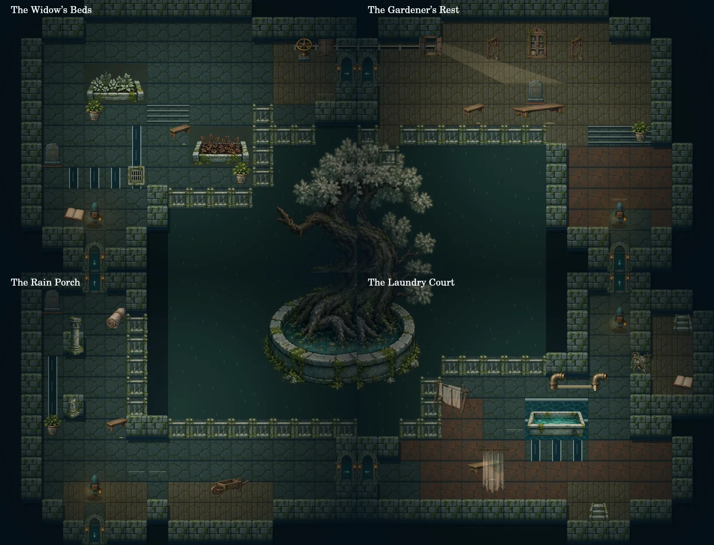

# The refuge around the rain tree

Hollowmere began as a small house beside a river crossing. When floods destroyed the bridge, its keepers sheltered stranded travellers. A formal guest hall grew beside the landing. The garden supplied food and medicines; the workshop repaired tools; laundry and service routes were added wherever the older walls allowed. Reused bridge stones and high mooring rings preserve the river's changing history.

The opening implements seven pieces of that building. It retains the nonlinear loop and existing puzzle progression. This is an architectural revision of the playable opening, not a claim of a completed two-hour campaign.

| Place | Architectural identity | Exploration and former use |
| --- | --- | --- |
| Last Watch | Columned nave, shallow apse, unequal side aisles | Three initial branches; admission stone and guest furniture establish the refuge. |
| Rain Porch | L-shaped covered arcade with storage pockets | The bend reveals the courtyard; cart ruts follow the service route toward laundry. |
| Widow’s Beds | Staggered raised terraces, drainage, wheel bay | The beds divide circulation; the drive shaft crosses the adjoining workshop wall. |
| Gardener’s Rest | Recessed window bay, bench, narrow delivery leg | A work area separate from deliveries; daylight falls toward the cabinet. |
| Laundry Court | Wet trough circuit, dry carrying route, screened recess | Translucent linen reveals movement behind it; the trellis controls the only entrance to the drying annex. |
| Broken Quay | Narrow high causeway above a disconnected lower landing | Water and mooring remains explain what was lost; the surviving route ends at the future cistern passage. |
| Borrowers’ Hall | Shelf aisles and a reading apse | A dogleg conceals and then reveals the reading stand; reused stone records an older exterior wall. |

## Spatial rules

Camera rooms share a world coordinate system. The central tree has one fixed position, so views from four sides belong to one courtyard. Matching thresholds have matching world coordinates. Each passage records its own threshold and safe arrival tile instead of deriving doors from screen centres. Paths use stone, boards, steps and drainage channels; planting beds, coping, balustrades and water block movement.

Large furniture has a rectangular collision footprint. Pushes validate the whole target footprint and cannot obstruct thresholds or arrival tiles. Linen screens remain traversable and translucent. Decorative architecture sits on blocked terrain, not on arbitrary walking tiles.

The map records the footprints of visited rooms and only the thresholds of passages already walked. It supplies no puzzle objectives or solution markers.

## Continuity and scope

The remote cabinet condition, blade reward, trellis discovery, placed Lantern, journal and global undo remain playable. Existing opening saves retain all puzzle and journal state. Spatial positions migrate to safe room arrivals, since old tile coordinates describe a different building. A pre-migration browser backup is retained.

Future chapter connections remain explicitly identified when inspected. The rest of the campaign still requires implementation and human playtesting. Automated walkthroughs establish mechanical solvability and reachability; they cannot establish puzzle difficulty or two hours of engaging play.
