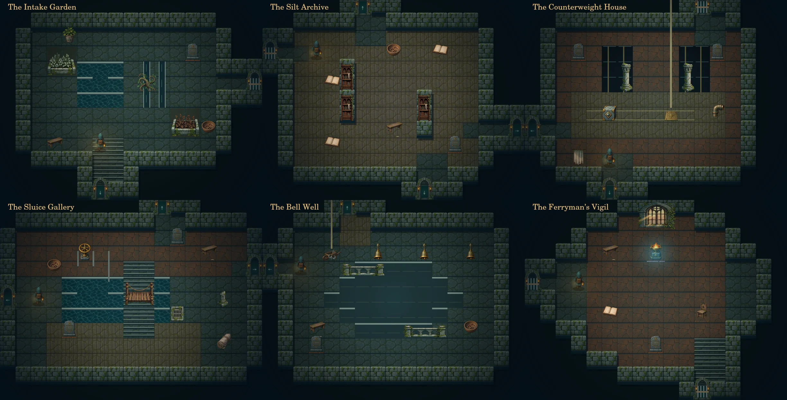

# The Drowned Works — implemented expansion

Version 1.2.0 adds six rooms to the seven-room monastery. This document contains designer spoilers; the game has no objective checklist, solution overlay, or recommended route.

The refuge once kept the river crossing open during floods. Its lifting equipment, washing return, settling garden and answering bells belong to the same public service. The ferryman's records connect the machinery to people sheltered in the original hall.

## Architecture

The works occupy the east side of the existing plan. The quay reaches a gallery around a branching watercourse. From there a dry walkway loops through the bell well, two lift shafts, and raised record shelves. A northern intake garden overlooks the final vigil chamber. Two permanently latched flood gates connect that chamber to the garden and counterweight house once the ferry signals are restored.

A second entrance runs between the laundry's trellised recess and the silt archive. It opens with the trellis, so the blade creates a shorter return route without being required to discover the works.

| New room | Distinct layout and role |
| --- | --- |
| Sluice Gallery | High walkway, channel crossing, separate branching pipes and sunken trash rack |
| Bell Well | Octagonal dry well with three bronze mouths and a suspended cargo cradle |
| Counterweight House | Twin vertical shafts with a horizontal ballast track and service loop |
| Silt Archive | Raised shelf aisles and book-cart passage connecting to the laundry |
| Intake Garden | Collecting basin, root-choked throat, staggered beds and northern gate |
| Ferryman's Vigil | Sheltered watch chamber above the highest flood, opening onto two routes |

## Intertwined problems

1. **Counterweight and hook.** The W2 cradle cannot rise against its load. A chain passes into W3, where an iron ballast trolley fits the recessed bearing. Push it along its constrained track to (9,7), then return to W2 to lift the brake and retrieve the Tidehook. This requires neither the blade nor the bell. The trolley cannot leave its track or be pushed into an unrecoverable corner.
2. **Shadow and guest's voice.** A W4 rubbing identifies the smallest finger in the Borrowers' Hall relief. Place the Lantern on A1's reader stand, turn the iron ornament to its third position, and press the relief. The aligned shadow and seam reveal an Echo Bell. The Lantern remains recoverable; the compartment latches open. This can be completed before the blade or hook.
3. **A water system across old and new rooms.** Cut the dead intake mat in W5 with the blade; pull the lodged sailcloth from W1's sunken rack with the hook; point W1's diverter to its bell branch; close C4's washing return. These settings can be established in any order. Inspection reports local water conditions. W2's well visibly fills only when the connected route is complete. No timer or instantaneous heating/cooling fiction is involved.
4. **Ferry signals.** W4's record gives a sequence of drawings: departing boat, bridge, moored boat. T1's persistent tide stains map those drawings to low, high and middle. Sound the Echo Bell at W2's corresponding bronze mouths while water drives the answering drum. A wrong response releases the pawls and resets the attempt. Three correct answers lift and permanently latch both W6 gates.
5. **Return of a keeper.** Recover the Tideglass in W6. Its five-sided foot and the ferryman's last page connect it to the blue, boat-marked niche in H. Use it there to restore the Tide vigil. The remaining four beacons are future work, not silently claimed completions.

These are converging branches. Tool acquisition is not ordered; the player can discover the water apparatus and both final gates before recovering any tool. The signal's evidence lies on both sides of the old/new boundary, and completing the region ends in a familiar room.

## Fairness and continuity

Existing saves keep tools, observations, notes, placed Lantern, completed cabinet and trellis state, and current coordinates. New progress lives under the expansion's own bounded state. Changing water never removes a walking floor, and completed gates do not fall again. Undo works across the original and new rooms, including acquisitions and the final vigil. The hook can also pull movable ringed objects while the player steps backward.

The original cabinet now uses an eccentric and visible brass rod on the shutter shaft. Closing the shutters withdraws the cabinet's retaining strip; inspection and opening feedback describe the same mechanism. The Borrowers' Hall undefined-context render crash is fixed and covered by complete-frame tests.

Automated walkthroughs cover three different acquisition orders, dry/wrong signal attempts, remote hydraulic conditions, gated access, final reward and return, migration, and undo. Every room and interactable is checked for reachability. Complete renderer calls are exercised with carried and placed Lantern states. These checks establish mechanical completion, not a measured human playtime or mobile usability result.
